# Calisthenics

- Stretches
    - [neck roll](#neck-roll)
    - [shoulder roll](#shoulder-roll)
    - [arm circles](#arm-circles)
    - [overhead arm reach](#overhead-arm-reach)
    - [chair rotation](#chair-rotation)
    - [cat-cow](#cat-cow)
    - [knee to chest](#knee-to-chest)
    - [thoracic extension](#thoracic-extension)
    - [scapular squeeze](#scapular-squeeze)
    - [wall angel](#wall-angel)
    - [superman](#superman)
- Exercises
    - [negative push-ups](#negative-push-ups)
    - [bear hold and knee taps](#bear-hold-and-knee-taps)
    - [pike push-ups](#pike-push-ups)
    - [superwoman pull-down](#superwoman-pull-down)
    - [seated alternatig leg-lifts](#seated-alternating-leg-lifts)
    - [reverse plank climbers](#reverse-plank-climbers)
    - [side plank hold](#side-plank-hold)
    - [side plank and reach combo](#side-plank-and-reach-combo)
    - [lunge pulses](#lunge-pulses)
    - [deadlift to lunge](#deadlift-to-lunge)
    - [deep lunge hold](#deep-lunge-hold)
    - [squat to frogstand](#squat-to-frogstand)
    - [low plank hold](#low-plank-hold)
    - [hollow hold + kicks](#hollow-hold--kicks)
    - [knee hug to hollow hold](#knee-hug-to-hollow-hold)
    - [flutter kicks](#flutter-kicks)
    - [hollow hold](#hollow-hold)
- Dumbbell exercises
    - [dumbbell goblet squat](#dumbbell-goblet-squat)
    - [dumbbell deadlift](#dumbbell-deadlift)
    - [dumbbell romanian deadlift](#dumbbell-rdls-romanian-deadlift)
    - [dumbbell lunges](#dumbbell-lunges)
    - [dumbbell step-ups](#dumbbell-step-ups)
    - [dumbbell bent-over rows](#dumbbell-bent-over-rows)
    - [dumbbell bench-press](#dumbbell-bench-press)
    - [dumbbell overhead shoulder press](#dumbbell-overhead-shoulder-press)
    - [dumbbell side raises](#dumbbell-side-raises)
    - [dumbbell reverse flyes](#dumbbell-reverse-flyes)
    - [dumbbell bicep curls](#dumbbell-bicep-curls)
    - [dumbbell lying tricep extensions](#dumbbell-lying-tricep-extensions)
    - [dumbbell plank row](#dumbbell-plank-row)

## Stretches

### Neck Roll

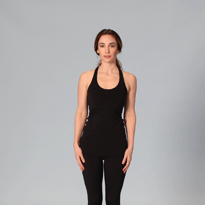

1. Stand or sit facing forward. Begin by tilting your neck to the right. You should feel the stretch through your neck to your trap muscle.
1. After a second or two, slowly roll your head counterclockwise.
1. Pause for a second or two when you reach your left shoulder.
1. Complete the rotation by ending where you started.
1. Repeat these steps, rolling clockwise.
1. Repeat this sequence 2–3 times.

### Shoulder Roll

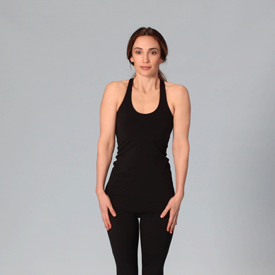

1. Stand with your arms down at your sides.
1. Roll your shoulders backward in a circular motion, completing 5 rotations. Then, complete 5 rotations forward.
1. Repeat this sequence 2–3 times.

### Arm Circles

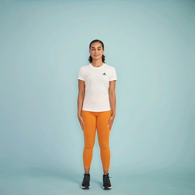

1. Stand with your arms out to your sides, parallel to the floor, with your palms facing down.
1. Slowly circle your arms forward, making small circles at first and eventually larger ones. Do this 20 times.
1. Reverse the movement and do another 20 circles.

### Overhead arm reach

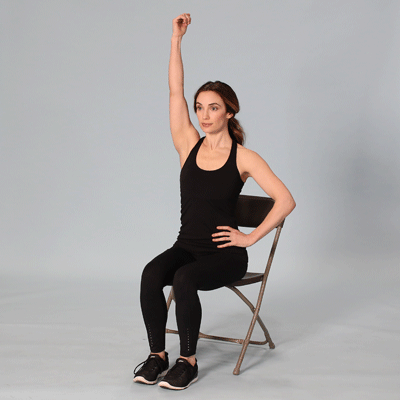

1. Sit in a chair, facing forward, with your feet on the floor.
1. Extend your right arm above your head and reach to the left. Bend your torso until you feel your right lat and shoulder stretch.
1. Return to the starting position. Repeat 5 times, then do the same thing with your left arm.

### Chair Rotation

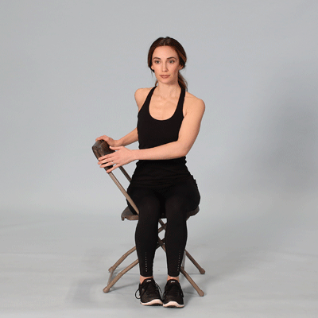

1. Sit sideways in a chair. Your right side should be resting against the back of the chair.
1. Keeping your legs stationary, rotate your torso to the right, reaching for the back of the chair with your hands.
1. Hold your upper body in rotation, using your arms to stretch more deeply as your muscles loosen.
1. Hold for 10 seconds. Repeat 3 times on each side.

### Cat-Cow

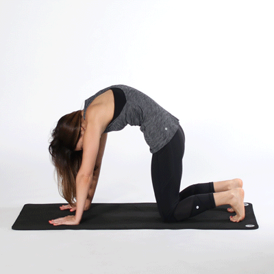

1. Start on all fours with your neck neutral.
1. Your palms should be under your shoulders, and your knees should be under your hips.
1. On an inhale, tuck your pelvis and round out your mid back. Draw your navel toward your spine and drop your head to relax your neck.
1. After 3–5 seconds, exhale and return to a neutral spine position.
1. Turn your face toward the sky, allowing your back to sink toward the floor. Hold for 3–5 seconds.
1. Repeat this sequence 5 times.

### Knee to chest

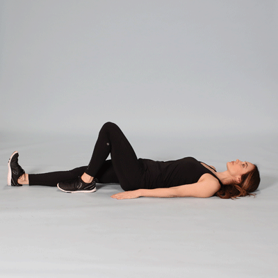

1. Lie face-up on the floor. Bend your left leg and bring it to your chest. Hold for 5 seconds, then release.
1. Repeat with your right leg.
1. Complete this sequence 3 times.

### Thoracic Extension

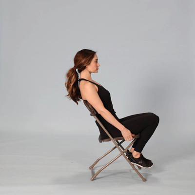

1. For best results, you’ll need a foam roller or a chair.
1. If you’re using a foam roller, position it under your thoracic spine. Allow your head and glutes to fall on either side. Extend your arms above your head to deepen the stretch.
1. If you’re using a chair, sit facing forward and allow your upper body to fall over the back of the chair. Extend your arms above your head for a deeper stretch.
1. Hold either position for 5 seconds, then release. Repeat 3 times.

### Scapular squeeze

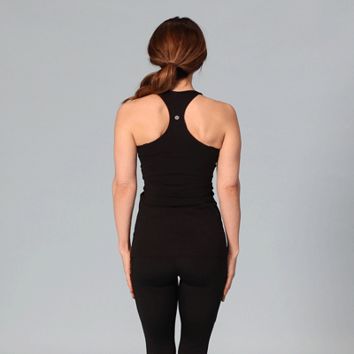

1. While standing with your arms down by your sides, squeeze your shoulder blades together. Hold for 5 seconds, then release.
1. Repeat 3–5 times.

### Wall angel

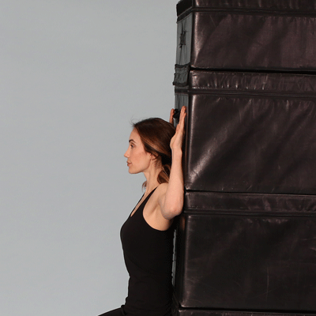

1. Stand with your back flat against a wall. You may need to step your feet out slightly to allow your back to soften against the wall.
1. Extend your arms to create a “T” shape against the wall, then bend your elbows to create 90-degree angles.
1. Slowly move your arms up and down in a “snow angel” motion, ensuring they stay flat against the wall the whole time.
1. When your fingers touch above your head, return to the starting position.
1. Complete 3 sets of 10 reps.

### Superman

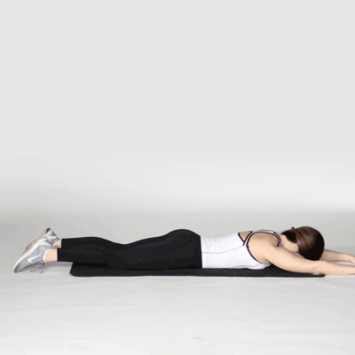

1. Lie on your stomach with your arms extended above your head.
1. Keeping your neck neutral, lift your arms and legs off the floor simultaneously. Make sure you’re using your back and glutes to lift.
1. Pause briefly at the top, then return to the starting position.
1. Complete 3 sets of 10 reps of the superman exercise.

## Exercises

### Negative push-ups

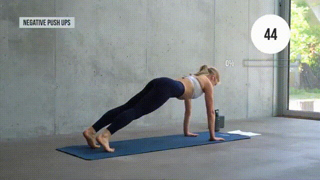

- Start in a plank position on your tiptoes.
- Lower your upper body until your chest touches the mat.
- Drop your knees to the floor.
- Reverse your movements (lift your chest, then knees) and repeat.

### Bear Hold and Knee Taps

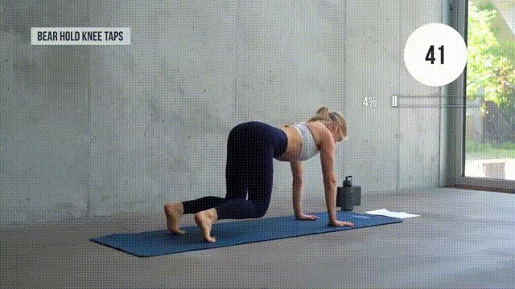

- Get on all fours with an engaged core. Your knees and hips should be in line. So should your hands and shoulders.
- Lift your knees off the floor and hold.
- Touch your left knee with your right hand.
- Alternate sides and repeat.

### Pike push-ups

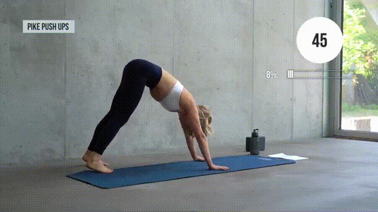

- Begin in downward-facing dog on tiptoes.
- Brace your core and grip the mat with your fingers spread wide.
- Bend your elbows to lower your body. Your head should almost touch the floor.
- Exhale as you push back and repeat.

### Superwoman pull down

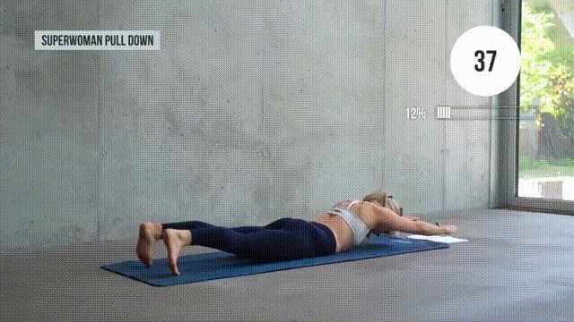

- Lie face down with toe tips touching the mat and arms stretched out.
- Bend your elbows and pull back using your lats. Imagine there’s a pencil between your shoulder blades that you’re trying to squeeze.
- Reverse and repeat.

### Seated Alternating Leg Lifts

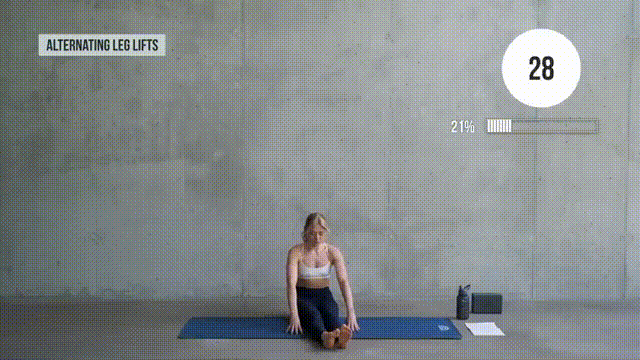

- Sit upright with your legs extended in front of you. Set your fingertips on the mat for stability.
- Squeeze your abs as you lift one leg.
- Pause briefly before lowering your leg.
- Switch legs and repeat.

### Reverse Plank Climbers

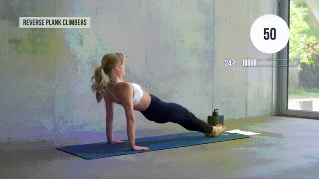

- Assume the starting position from the leg lift exercise. This time, place your hands behind your body, with your fingertips pointing towards your feet.
- Contract your glutes to lift your hips. Your drawn-down shoulders and heels should be in line.
- Lifting from your core, bring one knee toward your chest.
- Lower your leg, switch sides, and repeat.

### Side Plank Hold

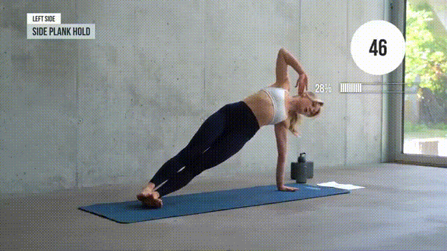

- Lie on your side, with your torso straight and legs stacked.
- Extend your bottom arm to prop yourself up on your palm.
- Draw your belly button to your spine and hold for 50 seconds. Don’t forget to breathe!

### Side Plank and Reach Combo

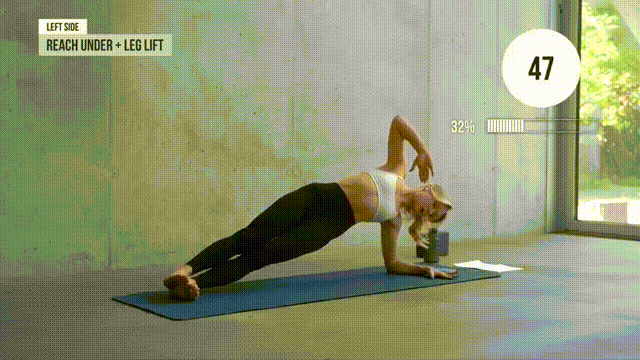

- Get in the side plank position and hold.
- Bend your top arm at the elbow.
- Twist your upper body and do a reach-under with your bent arm.
- Return to the starting position and lift your top leg.
- Lower your leg and repeat.

### Lunge Pulses

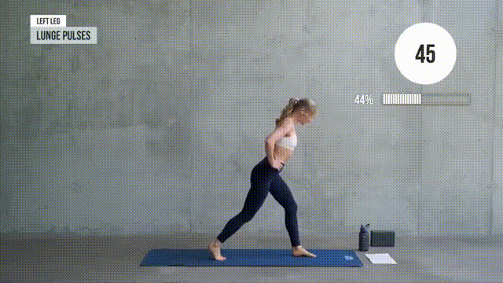

- Start in a split stance with a tucked pelvis and shoulders slightly ahead of your hips.
- Lift the heel of your right (rear) foot off the floor and firmly plant your left foot into the ground.
- Place your hands on your hips.
- Bend at the knees, hips, and ankles to lower your body. Stop when your left knee is at 90°.
- Maintain a slight bend at the knees and push yourself up a couple of inches.
- Repeat the previous two steps until the 50 seconds are up.

### Deadlift to Lunge

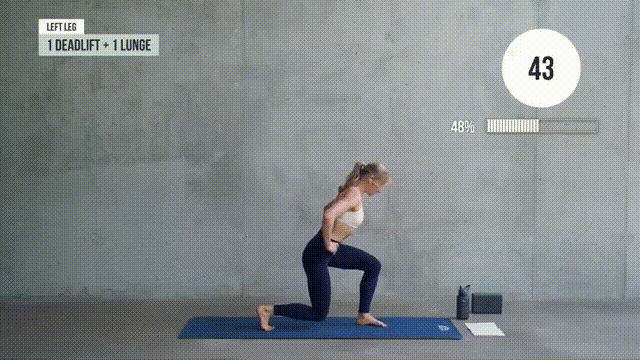

- Assume the starting position from exercise #9.
- Drop into a lunge.
- As you get up, shift your weight to your left leg and lift the right off the floor.
- While your leg goes in the air, your upper body should drop down. Imagine you’re trying to grab a pair of dumbbells from the ground.
- Grab those invisible dumbbells, get back to position, and repeat.

### Deep Lunge Hold

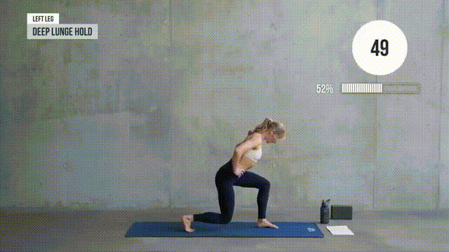

- Get in the lunge position.
- Drop down deep.
- Hold for 50 seconds (this will REALLY burn!).

### Squat to Frogstand

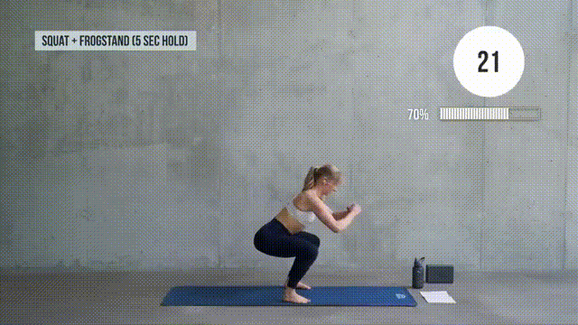

- Stand with your feet shoulder-width apart.
- Drop into a deep squat.
- At the bottom, place your hands on the floor. Spread your fingers and grip the mat.
- Rest your knees on the back of your upper arms.
- Maintain a bend in your elbow as you slowly lean and shift your weight forward.
- Keep your toe tips touching the ground initially and lift them gradually.
- Hold the position for 3–5 seconds before leaning back into a squat.
- Push your body up and repeat.

### Low Plank Hold

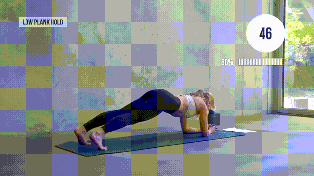

- Get into a forearm plank position.
- Keep your core tight and hold for 50 seconds.

### Hollow Hold + Kicks

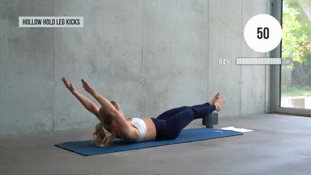

- Lie on your back with your arms extended overhead and legs lifted.
- Bend one knee to bring your leg closer to your chest. Hold for 2–3 seconds.
- Extend your leg.
- Repeat, alternating sides as you go.

### Knee Hug to Hollow Hold

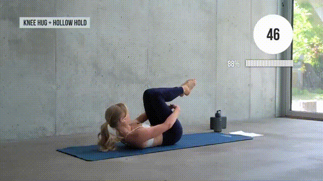

- Lie flat, with both knees bent over your chest. Your arms should reach under your knees.
- In slow and controlled motion, extend your arms and legs simultaneously. You’ll end up in a hollow-hold position.
- Return and repeat.

### Flutter Kicks

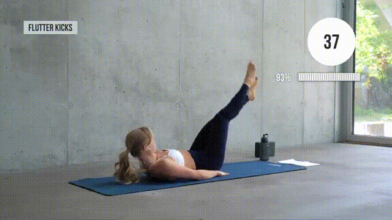

- Lie on your back.
- Lift your legs off the floor.
- Keep your legs straight as you flutter up and down.

### Hollow Hold

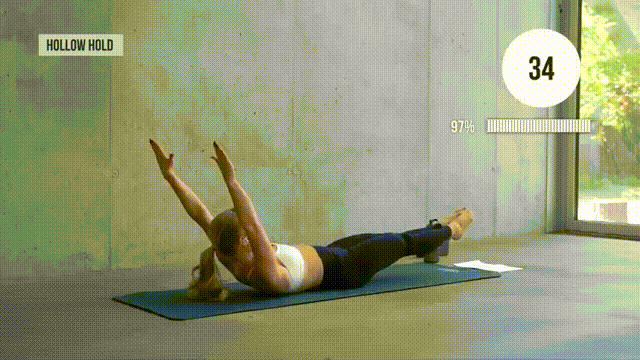

- You know the drill—lie on your back with extended arms and legs.
- Hold the position for 50 seconds.

## Dumbbell Exercises

### Dumbbell Goblet Squat

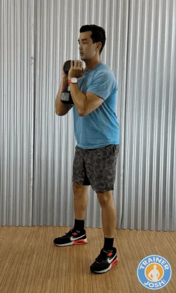

This is a beginner-friendly compound exercise that targets your quads by keeping your torso upright. It also makes it easier to squat deeper with good form, making them perfect for building lower-body strength while enhancing mobility and improving squat mechanics.

- Hold one end of a dumbbell with both hands against your chest with your elbows clamped down on the bottom end. Stand with your feet slightly wider than shoulder-width apart, with your toes turned out 10 to 15 degrees.
- Engage your core, then bend at your knees and push your hips back to lower your body down as low as comfortable without losing the arch in your lower back or letting your heels lift up.
- Let your hips drop straight down between your heels until your thighs reach at least parallel, but preferably lower. Keep the dumbbell close to your body.
- Drive your body back up by pushing through your midfoot and heel. Focus on squeezing your quads.

> Trainer Tip:  Let your knees travel forward over your toes as long as your heels stay down to maximize quad activation. Keep your elbows inside your knees at the bottom to open your hips and maintain balance.
> 
> Dumbbell Goblet Squats are a lot like Dumbbell Front Squats. Goblet squats are more beginner-friendly, while the front squat challenges your stability and upper back/core more. I don’t program them into the same session but alternate them across different workouts.

### Dumbbell Deadlift

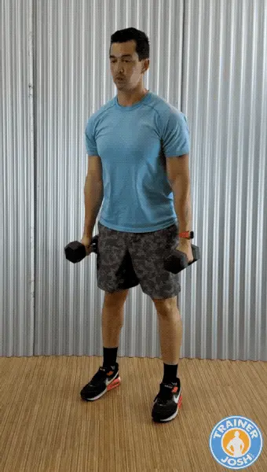

Dumbbell deadlifts are a powerful compound exercise for building lower body strength, especially in the glutes, hamstrings, and lower back. Dumbbells give you a greater range of motion than the barbell deadlift. They can be easier on the joints (especially your lower back if you’re taller).

- Stand with your feet hip-width apart. Hold a dumbbell in each hand with your palms facing your thighs.
- Brace your core by tightening your abs, and keep your back straight.
- Breathe in as you lower your hips by bending your knees and lowering your hips until your thighs are parallel or slightly below parallel to the ground.
- Then breathe out as you stand back up into the starting position. Keep your chest and back straight, squeezing your shoulder blades together on your upper back.

> Trainer Tip: Focus on quality over quantity. Slow and controlled lowers build strength and prevent injury better than heavy sloppy reps. Prevent rounding your back (keep spine neutral), don’t let the dumbbells drift away from your body, and imagine there’s a chair right behind you that you’re trying to sit down on.

### Dumbbell RDLs (Romanian Deadlift)

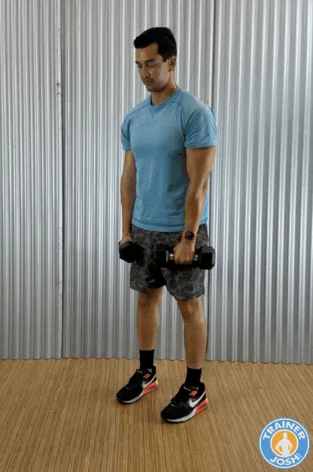

Dumbbell RDLs are one of the best dumbbell exercises for targeting and strengthening your hamstrings, glutes, and lower back. They’re also great for developing the posterior chain (the backside of your body), which is usually neglected but essential for athletic performance, injury prevention, and good posture.

- Stand with your feet hip-width apart. Hold a dumbbell in each hand in front of your thighs, palms facing your front thigh.
- Keep your knees soft and slightly bent, then hinge your torso forward by pushing your hips back and lowering the dumbbells down the front side of your legs, keeping your back flat in a straight line and your chest arched out.
- Lower until you feel a stretch in your hamstrings. Depending on your flexibility, the dumbbells should go just below your knees or mid-shin.
- Breathe out as you return to the starting position by pushing through your hips and squeezing your glutes as you drag your hips forward, back into standing.

> Trainer Tip: Perform the lowering phase slow than the lifting phase (3-4 seconds down, 1-2 seconds up) for maximum hamstring and glute engagement. Avoid common mistakes like locking or hyper-bending your knees (kills hamstring tension), letting the dumbbells drift away from your body, rounding your lower back instead of hinging at the hips, and don’t drop too low past your flexibility range.

### Dumbbell Lunges

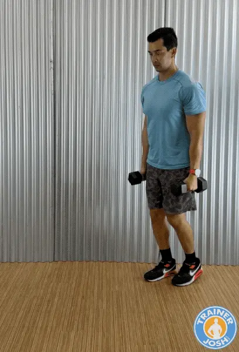

Dumbbell lunges are a dynamic yet functional exercise that’s great for building strength and muscle in your quads, glutes, and hamstrings. They also help to improve balance, coordination, and core stability. Dumbbell lunges train each leg independently, making them a great unilateral exercise.

- Stand tall and hold a dumbbell in each hand, palms facing your sides. Your arms should be straight, and your feet should be hip-width apart.
- Take a big step forward with one leg and lower your hips until both knees are bent at about 90 degrees.
- Keep your abs tight and your chest up as your back knee hovers just above the floor, about an inch or two, and your front thigh is parallel to the ground.
- Breathe out as you drive through your front heel to push yourself back up into the starting position.
- Repeat on the other leg, alternating sides for each rep.

> Trainer Tip: To maximize your results, keep constant tension by stopping just short of locking out your knees at the top. If you have trouble balancing, then try reverse lunges and they can be easier on the knees but just as effective.
> 
> Avoid common mistakes like taking too short a step (causes knees to go too far past toes), leaning forward or arching the back, letting the front knee cave inward, and rushing through reps instead of lowering with control.

### Dumbbell Step-Ups

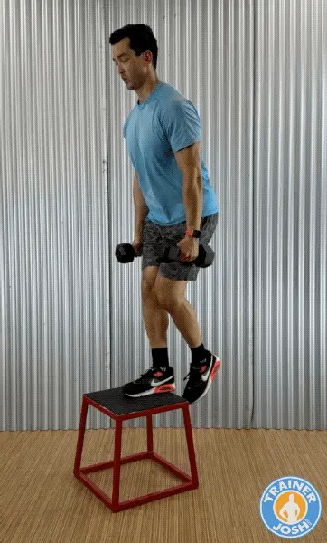

Dumbbell step-ups are a great unilateral and functional exercise that targets your quads, glutes, and hamstrings while improving single-leg strength, balance, and coordination. Step-ups can really hit your gluteus maximus hard and get your heart rate cranking for an extra calorie burn.

You’ll need an exercise box for this one. But can also use a sturdy chair or another elevated platform that is about knee height. Just be careful and make sure it’s stable.

- Stand facing a sturdy box or bench that’s about knee height. Hold a dumbbell in each hand at your sides.
- Step up by placing one foot firmly on the bench so your whole foot is on it. Then press through your front heel to lift your body up until your leading leg is nearly straight. Keep a slight bend in the knee to keep muscle activation in your quads.
- Then, carefully step back down with the trailing foot, followed by the lead foot, to return to the starting position.
- Alternate and repeat on the other leg, alternating each leg with each rep.

> Trainer Tip: Keep your torso upright and eyes forward for balance. Lean slightly forward for more glute emphasis, and focus on driving through the heel of your working leg.
> 
> Common mistakes to avoid include letting the back leg push off too much (steals work from the front leg), only placing part of your foot on the bench, rounding your lower back, and dropping too fast instead of controlling the descent.

### Dumbbell Bent-Over Rows

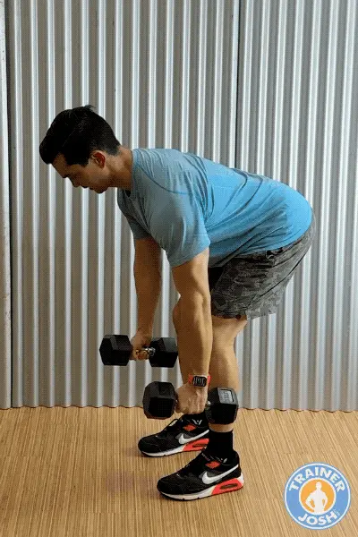

The dumbbell bent-over rows exercise is one of the best exercises for building a strong, muscular back while also improving your posture and pulling strength. It mostly targets your lats, rhomboids, and traps, but also engages your lower back, rear delts, and biceps. It’s a great exercise for fixing chest muscle imbalance while reducing the risk of shoulder injuries.

- Hold a dumbbell in each hand, palms facing your body. Engage your core by tightening your abs, then hinge at your hips with a flat back until your torso is about 45 degrees forward. Keep your knees slightly bent.
- Let the dumbbells hang down by extending your arms fully towards the floor, and the dumbbells should be right in front of your shins.
- Pull the dumbbells upward towards your waist by driving your elbows back and keep them close to your body. At the top, squeeze your shoulder blades together.
- Pause and squeeze at the top by pausing briefly to maximize the contraction.
- Slowly lower the dumbbells back down to the starting position without rounding your lower back.

> Trainer Tip: Perform rows with a slow eccentric (lowering phase) to build more muscle. Keep your abs tight to take stress off your lower back and instead place it on your core.
> 
> Common mistakes to avoid include roudning your lower back or jerking the weights. Letting your elbows flare out instead of staying tucked. Using momentum instead of controlled pulling.

### Dumbbell Bench Press

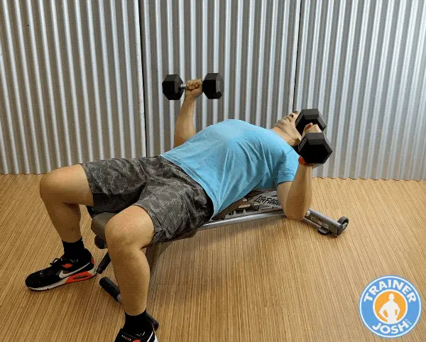

The dumbbell bench press is a staple upper body exercise that is great for building strength and size in your chest, shoulders, and triceps. Dumbbells are recommended for beginners instead of the barbell because they engage more stabilizing muscles and enhance symmetry between body sides. Dumbbells allow a greater range of motion, improve muscle activation, balance, and joint health.

This exercise requires a bench. I recommend getting an adjustable bench at home since it’s more versatile. You can train at different angles to target your muscles from multiple positions. Variety in your at-home workouts helps keep them effective and engaging.

- Sit on a bench with a dumbbell in each hand. Lie back with your feet flat on the floor. Keep your feet flat and planted firmly on the ground for stability.
- Hold the dumbbells at chest level and in line with your chest. Keep your elbows bent with palms facing forward. Elbows should be bent at about 75-90 degrees.
- Breathe out as you press the dumbbells straight up by extending your arms. But stop short of your elbows fully locking out, and don’t let your arms go completely straight. Keep your elbows slightly bent at the top.
- Breathe in and control the dumbbells as you slowly lower them back to the starting position.

> Trainer Tip: Pause briefly at the bottom before pressing back up to maximize the stretch at the bottom and increase mechanical tension. Avoid clanking the dumbbells together at the top.
> 
> Common mistakes to avoid include flaring your elbows too wide (strains shoulders). Letting your lower back arch excessively. Dropping the dumbbells too quickly instead of controlling on the way down. Allowing your wrists to bend backwards instead of staying neutral.

*Alternate Version*: If you don’t have access to a bench, then you can do the Floor Press version instead. You just lie on your back on the floor, but it won’t be as effective because you won’t get the full range of motion, as the ground will stop your elbows.

### Dumbbell Overhead Shoulder Press

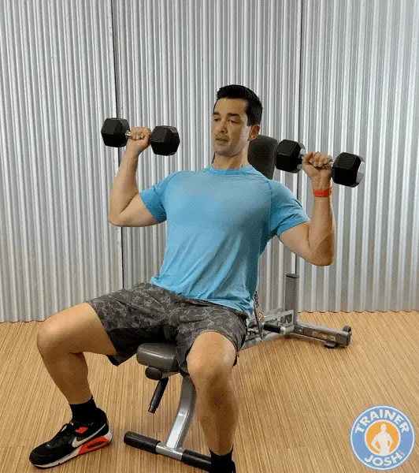

Dumbbell shoulder presses are one of the best exercises for building strong, defined shoulders. The advantage of using dumbbells for the shoulder press is that it’ll allow each arm to work independently, fix strength imbalances, and activate stabilizing muscles better than the barbell.

I prefer doing this exercise seated using an adjustable bench to reduce lower body involvement, back strain, and momentum.

- Set up an adjustable bench so it’s about 90 degrees vertical or slightly less. Sit on the bench and hold a dumbbell in each hand. Then bring the dumbbells up so they’re at shoulder height with your palms facing forward and your elbows bent about 90 degrees.
- Squeeze your shoulder blades together on your back. Arch up your chest and tighten your abs. Exhale and press the dumbbells straight overhead in a controlled manner until your arms are fully extended, but your elbows aren’t locked out completely.
- Keep your back pressed against the bench and your abs tight throughout the movement. Do not bring the dumbbells together and clink them, but instead press them directly over your shoulders.
- Breathe in as you slowly lower the dumbbells back down to shoulder height to repeat the movement.

> Trainer Tip: Avoid clanking the dumbbells together at the top and stop just short of locking out your elbows comopletely. You can also do the shoulder press while standing which will challenge your balance and core more but can put more stress on your lower back.
> 
> Common mistakes to avoid include arching the lower back, flaring elbows directly out to the sides, shrugging shoulders up towards the ears, and using momentum instead of controlled pressing.

### Dumbbell Side Raises

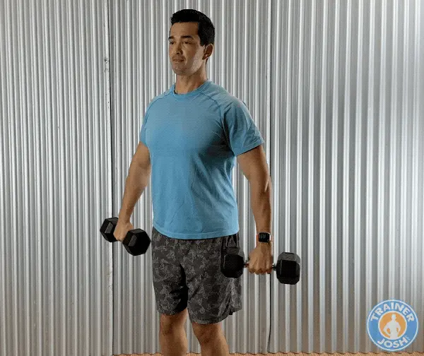

Dumbbell side raises exercise is terrific for isolating and targeting your side lateral deltoids. It will enhance shoulder definition and aesthetics by giving you that wide, rounded shoulder look. It also improves shoulder symmetry by balancing out the front and the back.

- Get in the starting position by standing tall with a dumbbell in each hand at your sides, your palms facing inward towards your body, and keeping a slight bend in your elbows. Squeeze your shoulder blades on your back together, arch up your chest, and tighten your abs.
- Breathe out as you raise the dumbbells out to your sides until they reach shoulder height. Focus on leading with your elbows, not your hands. Don’t allow your arms to drift out in front of your body, since you’ll be compensating by using more of your traps.
- Pause briefly at the top and squeeze your side delts.
- Breathe in as you slowly lower the dumbbells back down in a controlled motion. Don’t just let them drop. Avoid swinging or using momentum to maximize the exercise.

> Trainer Tip: Use a lighter weight dumbbell and use strict control to keep tension on your side delts. Tilt your pinky slightly upward at the top like pouring water from a jug to increase lateral delt activation. Keep your wrist neutral and avoid shrugging with your traps to keep it isolated on your side delts.
> 
> Common mistakes to avoid include swing the dumbbells for momentum (reduces effetiveness). Lifting too high above shoulder height that will shift stress to your traps and is harder on your shoulder joint. Locking out arms completely (keep a slight bend to them). Shrugging shoulders instead of isolating the delts.

### Dumbbell Reverse Flyes

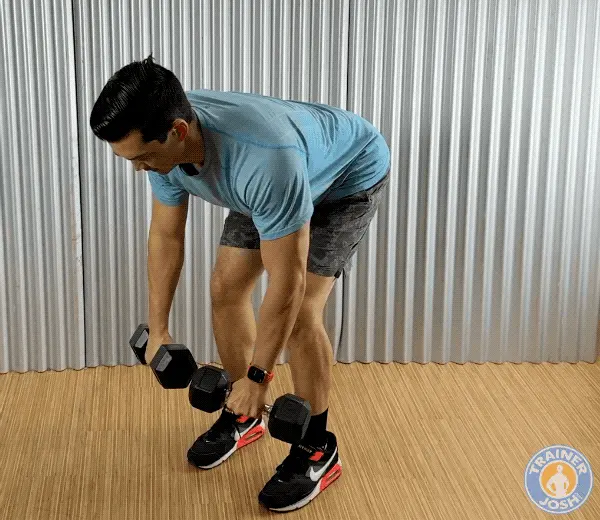

The dumbbell reverse flye exercise isolates and targets your rear posterior delts. This is a very commonly under-trained shoulder head. It’ll help improve your posture by strengthening your upper back and reversing rounded shoulders from too much pressing. It’s a great exercise for enhancing aesthetics and overall upper body health.

- Get in the starting position by hinging forward at your hips with a flat back and your knees bent. The dumbbells should be hanging below your chest with your palms facing towards your legs.
- Tighten your abs to engage your core and take stress off your lower back. Squeeze your shoulder blades together and arch out your chest.
- Breathe out as you raise the dumbbells out to the sides in a wide arc. Keep a slight elbow bend and your arms in a fixed position throughout the movement.
- Pause briefly at the top and hold for a second to fully contract your rear delts. Then, breathe in as you slowly lower the dumbbells back down to the starting position in a controlled fashion.

> Trainer Tip: Go lighter with this exercise to keep strict form and controlled tempo. If you have trouble stabilizing your body then sit on a bench to do this exercise.
> 
> Common mistakes to avoid include using momentum or swinging the torso. Rounding the back instead of hinging at the hips. Straighting the arms too much (stresses elbow joint). Shrugging shoulders which shifts work to the traps instead of rear delts.

### Dumbbell Bicep Curls

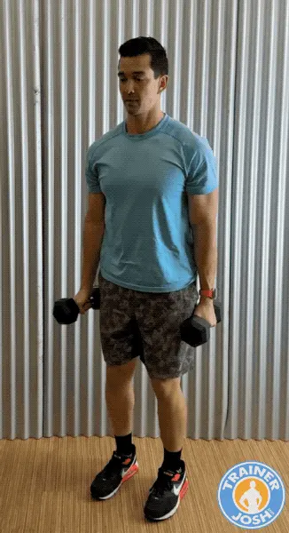

Dumbbell bicep curls are a classic arm-building and isolation exercise that works both heads of your biceps. It’ll help to fix muscle imbalances and enhance coordination since each arm is working independently. Stronger biceps will also help with doing pulling movements like pull-ups so doing this exercise is both aesthetic and functional for upper body development.

- Hold a pair of dumbbells at your sides while standing tall, your chest up, your shoulders back, and your elbows pinned to your sides.
- Start with your palms facing inward. As you curl up, turn your palms so they face up at the top of the movement. Keep your elbow at your side. Don’t let it move forward—your shoulder will try to help, but that takes work away from your biceps.
- When the dumbbell reaches the top, pause and squeeze your biceps hard to maximize muscle contraction. Keep focusing on keeping your elbows back and not letting them drift forward.
- Slowly lower the dumbbell back into the starting position for 2-3 seconds. This is the eccentric phase, which is key to building muscle.

> Trainer Tip: Use a slow eccentric (3-4 seconds lowering) to create more mechanical tension for muscle growth. Focus on keeping your working shoulder back and locked in while lifting the dumbbell. Keep your elbow locked to your side and don’t let it drift upward.
> 
> Common mistakes to avoid include swinging the dumbbells or using your back for momentum. Letting your elbows drift forwards (turns it into a shoulder exercise. Curling the wirsts (reduces tension in your biceps). And rushing through reps instead of controlling the lowering phase.

### Dumbbell Lying Tricep Extensions

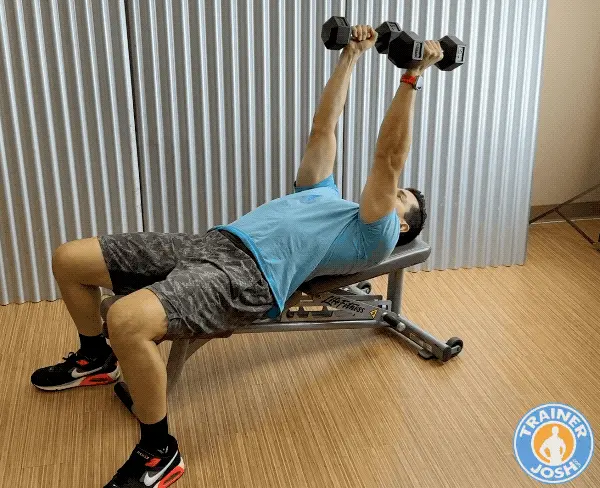

Dumbbell triceps extension (aka “skull crushers”) is one of the most effective isolation exercises for strengthening and sculpting the triceps (back of your upper arm). Strong triceps improve both arm definition and boost power for bigger compound exercises like the chest bench press. This exercise gives you a full stretch and contraction of the triceps, making it one of the best movements for muscle growth.

- Lie flat on a bench while holding a dumbbell in each hand. Then, extend your arms straight above your shoulders with a neutral grip (palms facing each other).
- Keep your elbows locked in position and in line with your shoulders. Don’t let your elbows flare out. This will keep tension off your shoulders and on your tricep muscles.
- Bend your elbows to slowly lower the dumbbells just outside the top of your head or even slightly behind it.
- Pause and feel the stretch in your triceps at the bottom before extending your elbows back to the top and straightening your arms.  At the top, squeeze your tricep muscle to maximize the contraction, but don’t lock out too hard.

> Trainer Tip: Angle the dumbbells so they’re slightly behind your head instead of directly over your face. This keeps tension on the triceps muscle throughout the entire range of motion. Pause briefly at the bottom to maximize the stretch and muscle activation.
> 
> Common mistakes to avoid include flaring elbows outward (shifts tension off triceps). Dropping the dumbbells too low and straining the elbows or shoulders. Moving the upper arms instead of keeping them locked in position.

### Dumbbell Plank Row

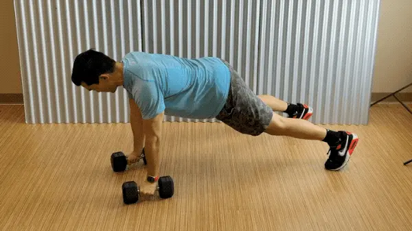

Dumbbell plank rows (also called “renegade rows”) are a highly effective core movement that also strengthens your back, shoulders, and arms. You’ll be heavily engaging your core for stability, too. It’ll challenge your balance and anti-roational strength, so it’s a great exercise for building functional fitness. This exercise is great for anyone looking to become more athletic.

- Get into a high plank position with a dumbbell in each hand with your palms facing each other. It’s recommended to use hex dumbbells in this one for easier stability. Your feet shoulder slightly wider than shoulder width apart.
- Keep your wrists stacked under your shoulders. Engage your abs and glutes to keep a straight line from your head to your heels.
- Row one dumbbell up by pulling one up towards your waist by driving the elbow back. Keep your hips square to the floor.
- Lower the dumbbell slowly under control to the ground without twisting your torso.
- Alternate sides and perform the row with the other arm. Keep the strong plank position throughout the movement.

> Trainer Tip: Pause briefly at the top of each row for maximum core activation. Focus on keep your body as straight as you can and body square facing the ground.
> 
> Commong mistakes to avoid including letting your hips rotate or sag. Widening the row into a bicep curl insead of pulling back straight. Holding your feet too close toegther which will reduces stability.

## Links

- [beginner friendly calisthenics](https://tgffitness.com/workouts/at-home-calisthenics-workout/)
- [dumbbell exercises](https://trainerjosh.com/workouts/dumbbell-exercises-beginners/)
- [back and shoulder stretches](https://www.healthline.com/health/fitness-exercise/upper-back-pain-exercises#strengthening-exercises)